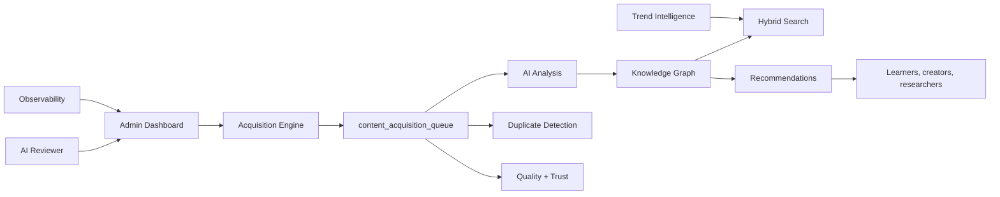
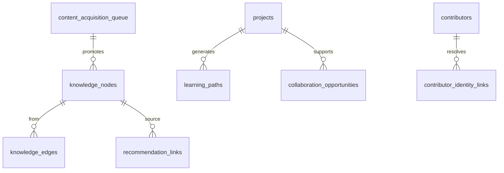

# Arpit Labs Platform Audit

## Architecture Diagram

## Database Diagram

## Search Architecture
- Keyword search reads existing `projects`.
- Vector-compatible search reads `ai_knowledge_base`.
- Hybrid search merges and deduplicates both result sets.
- Query analytics are stored in `semantic_search_queries`.

## AI Architecture
- Deterministic analysis and scoring are implemented now for safe production rollout.
- Existing `ai_knowledge_base` and `ai_embeddings` remain compatible with future OpenAI/pgvector-powered upgrades.
- Media generation is queued and feature-flagged off by default until a provider is configured.

## Scaling Plan
- Redis cache keys are defined in `scalingPlan`.
- Queue names are defined for acquisition, analysis, duplicate checks, media, and recommendations.
- New indexes support acquisition filtering, duplicate checks, graph traversal, recommendations, review triage, and observability.

## Security Review
- Existing authentication and admin middleware were not changed.
- `/api/admin/acquisition` uses existing admin request validation.
- New migration is additive and does not modify production content.
- Public read policies are limited to knowledge resources intended for discovery.
- Mutations remain server-side through service-role clients and admin-checked routes.

## Production Readiness Score
**82 / 100**

The platform foundation is modular, feature-flagged, and deployable without breaking existing workflows. Remaining production upgrades are external provider connectors, pgvector RPC similarity, Redis/worker deployment, and image generation provider configuration.
